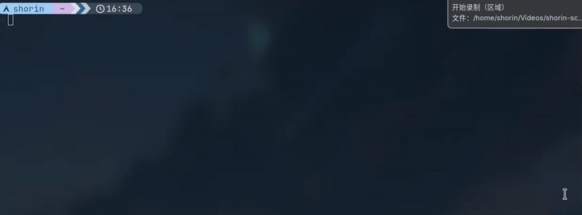
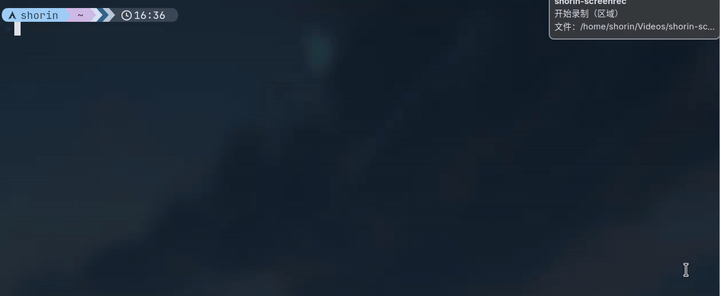
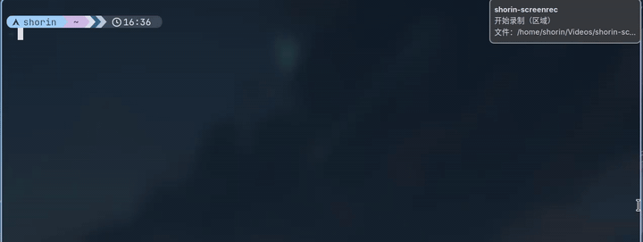
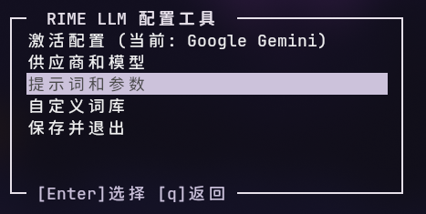
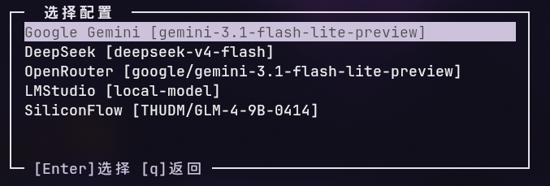
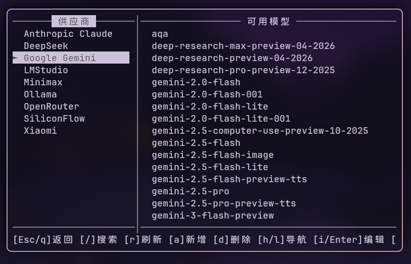
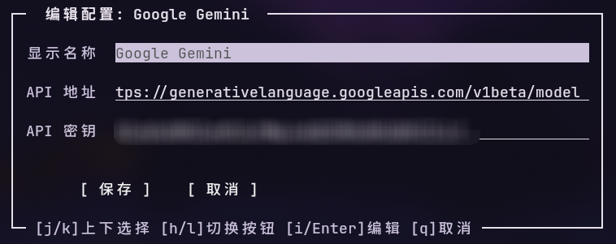
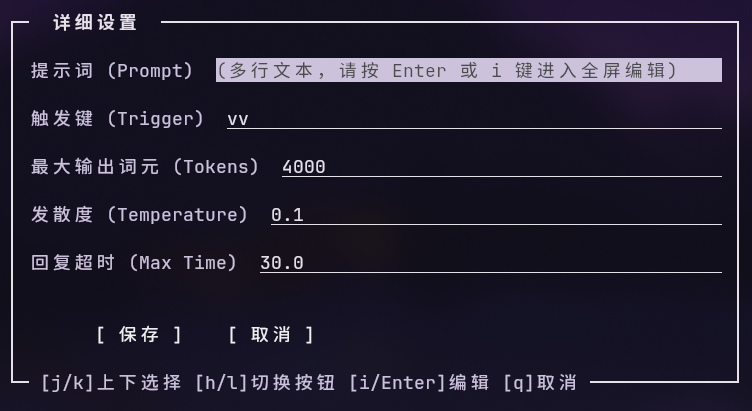
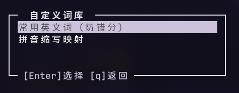
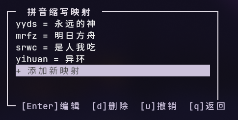

# rime-llm

rime雾凇拼音输入法的Ai候选词生成扩展。类似云拼音，平时正常输入，在遇到长难句或者生僻句的时候通过双击v键呼叫Ai对拼音进行处理。输入的时候不太需要考虑输入的拼音是否正确，大模型强大的预测功能会自动把误拼甚至乱序处理成正确的句子。对于句子中的英文词汇也能正常处理，甚至还能补充正确的空格和标点符号。

以下是无法正常输入，但Ai可以联想出来的例子：

包含英文词汇的输入



歌词


古诗词



超长句



## 使用方法

1. 安装rime和雾凇拼音

    > 对其他基于rime的输入法方案也是生效的，例如万象拼音，但是要自己收手动配置。

    输入法安装方法可以看[ShorinArch_中文输入法](https://github.com/SHORiN-KiWATA/Shorin-ArchLinux-Guide/wiki/%E4%B8%AD%E6%96%87%E8%BE%93%E5%85%A5%E6%B3%95)

2. 安装`rime-llm-translator-git`

    ```
    yay -S rime-llm-translator-git
    ```

    此时会安装三个文件：

    - `/usr/share/rime-llm-translator/default_state.json` 默认配置文件。用户空间的配置文件位于`~/.config/rime-llm-translator/state.json`。

    - `/usr/share/rime-data/lua/llm_translator.lua` 功能主体。

    - `/usr/bin/rime-llm-config` 管理工具，支持TUI编辑配置文件。

3. 运行`rime-llm-config init`初始化

    初始化完成后会有使用教程提示。

    这一步会自动在`~/.local/fcitx5/rime`编辑配置文件：

    > 配置文件在修改前会备份至`~/.cache/rime-llm-translator-backup`
    
    - 新建`rime.lua`导入`llm_translator`；
    
      > 如果已经存在的话会备份后在文件末尾追加
    
    - 如果检测到安装了雾凇拼音的话会新建`rime_ice.custom.yaml`写入patch，启用llm_translator；
    
    - 如果fcitx5正在运行的话，重启以重新部署。
    
4. 配置大模型

    运行`rime-llm-config`命令进行模型配置。自带了一个硅基流动的 GLM-4 试用，效果很差，算是体验一下hhh

## 编辑配置

`rime-llm-config`是编辑配置的TUI工具。



- 激活配置

  此处可以设置具体使用哪一个配置

  

- 供应商和模型

  

  最左侧一列是供应商（同时也是配置），回车可以配置供应商的显示名称、api地址、api密钥等内容

  > 显示名称指的是在输入法候选框里显示的名称

  

  配置可用之后右侧会出现`可用模型`列表，回车确定此配置使用的模型。

- 提示词和参数

  

  这里可以对系统提示词和模型参数进行配置。

- 自定义词库

  

  这里可以自定义词库。`常用英文词`是为了避免ai把句子中的英文视为拼音进行分词；`拼音缩写映射`可以提高首字母缩写、简拼的联想质量。

  
